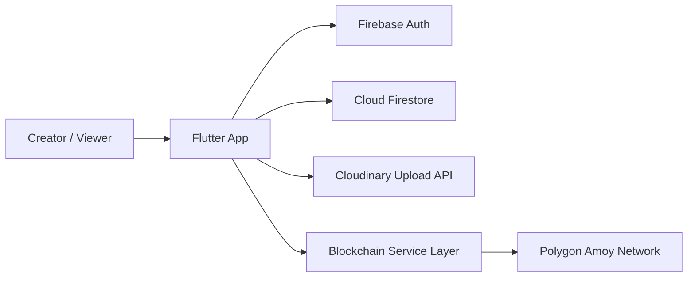
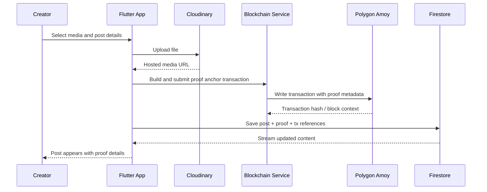
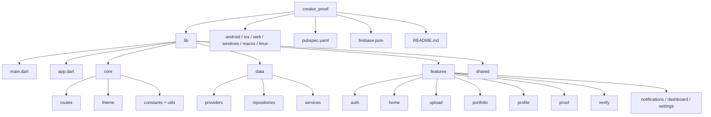

# CreatorProof 🎨🔗

CreatorProof is a Flutter-powered platform for creators to publish digital content with transparent proof-of-authorship metadata.  
It combines media publishing, social discovery, and blockchain anchoring into one trust-first creator experience.

---

## Problem Statement 🚩

Digital creators often struggle to prove ownership and originality of their work across platforms.  
Traditional social apps optimize for reach, but not for authenticity and verifiable attribution.

CreatorProof addresses this gap by enabling:

- immutable and verifiable proof references anchored on-chain
- stronger creator identity through portfolio and profile credibility signals
- transparent proof records directly linked to published media assets

---

## Solution Overview 💡

CreatorProof combines:

- a **Flutter-first product experience** that delivers smooth creator and viewer journeys across mobile, web, and desktop
- a **Firebase-powered application layer** that handles secure authentication, creator profiles, social content, engagement, and real-time proof records
- a **Cloudinary media infrastructure** that provides reliable upload, hosting, and delivery for creator-generated files
- a **Polygon Amoy blockchain integration layer** that anchors proof metadata and transaction references for independent verification

Each published work is enriched with proof metadata, transaction context, and certificate-style verification views so authenticity can be validated with confidence.

---

## Architecture (Visual Representation) 🏗️

---

## Publish + Proof Flow (Visual Representation) 🔄

---

## Tech Stack 🧰

| Layer | Technology | Purpose |
|---|---|---|
| Frontend | Flutter + Dart | Cross-platform UI (mobile, web, desktop) |
| State Management | `provider` | App-wide state for auth/theme and reactive updates |
| Routing | `go_router` | Declarative route management and navigation |
| Authentication | Firebase Auth + Google Sign-In | Identity and session handling |
| Database | Cloud Firestore | Posts, users, proofs, comments, notifications |
| Media | Cloudinary + `http` multipart | Upload and host creator media |
| Blockchain | `web3dart` + `crypto` | Proof anchoring and transaction metadata |
| Secure Local Storage | `flutter_secure_storage` | Wallet key material and sensitive app values |
| UI/UX Packages | `google_fonts`, `flutter_animate`, `shimmer`, `cached_network_image` | Visual polish and smooth user experience |

---

## Project Structure (Architecture View) 🗂️

---

## Key Features ✨

- **Secure creator onboarding and identity management** with Firebase Authentication and Google Sign-In support.
- **Discovery-first global content feed** that enables engagement through likes, comments, and social interactions.
- **Professional media publishing workflow** with structured upload, hosted asset delivery, and post lifecycle handling.
- **Blockchain-backed proof anchoring pipeline** that records transaction context for trustworthy authorship verification.
- **Dedicated proof and certificate presentation layers** to make authenticity signals understandable to both creators and viewers.
- **Creator portfolio and profile intelligence surfaces** that improve visibility, credibility, and audience trust.
- **Integrated notifications and dashboard experiences** for activity awareness and performance-oriented creator insights.
- **Modern adaptive theming and polished UI system** designed for consistent cross-platform usability.

---

## 👨‍💻 Author

Made with ❤️ by **Shreyash-devs**  
A passionate developer who enjoys turning ideas into reality using tech and a touch of creativity.

- 🔗 [LinkedIn](https://www.linkedin.com/in/shreyashdubewar)  
- 📱 [GitHub](https://github.com/shreyash-devs)  
- ✉️ shreyashdevs.work@gmail.com
